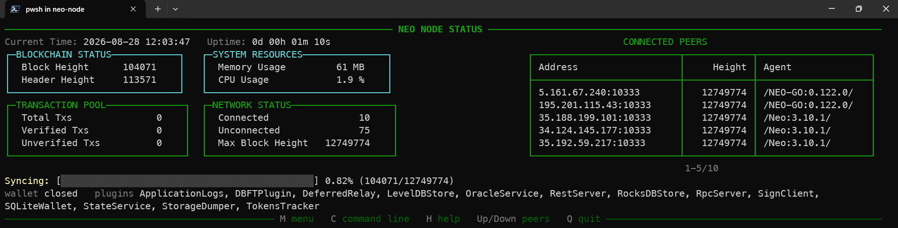
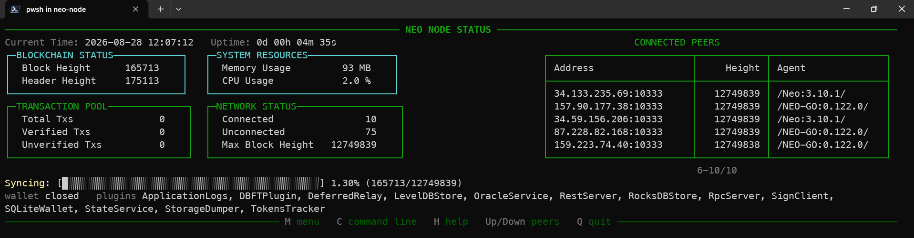
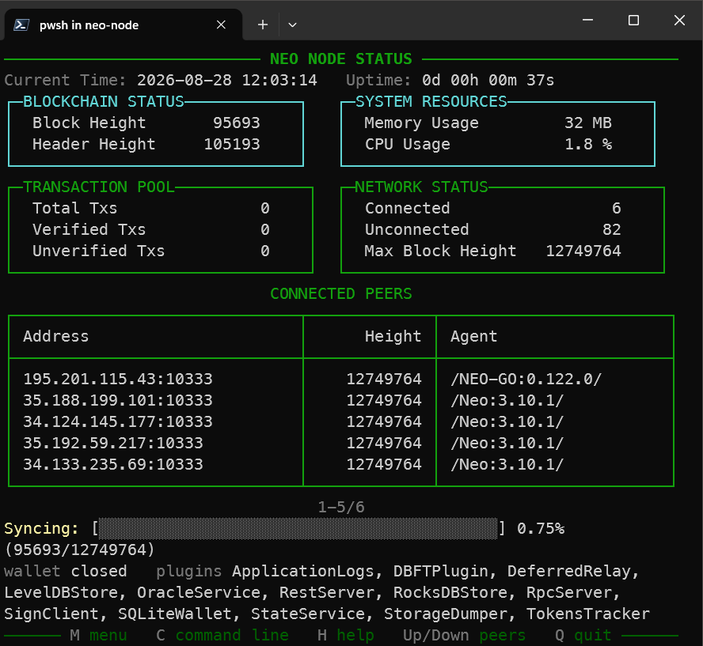
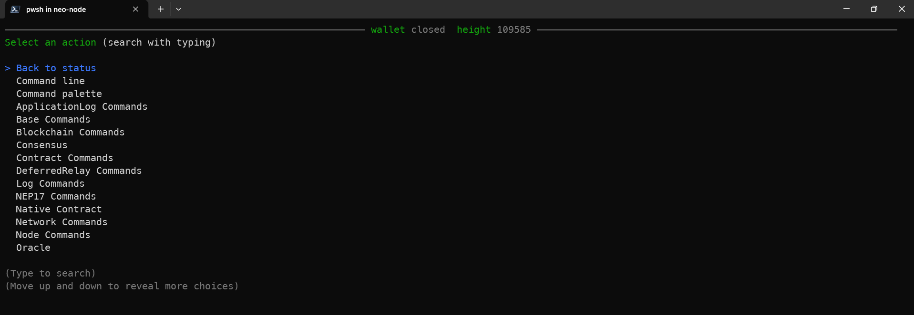
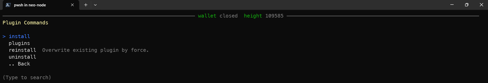
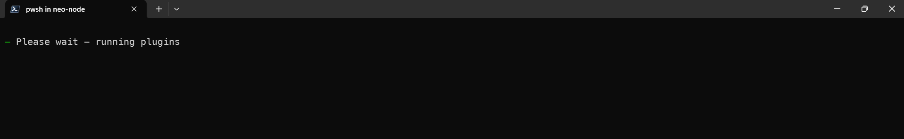
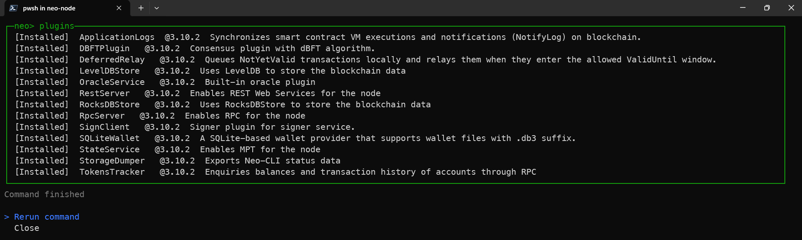
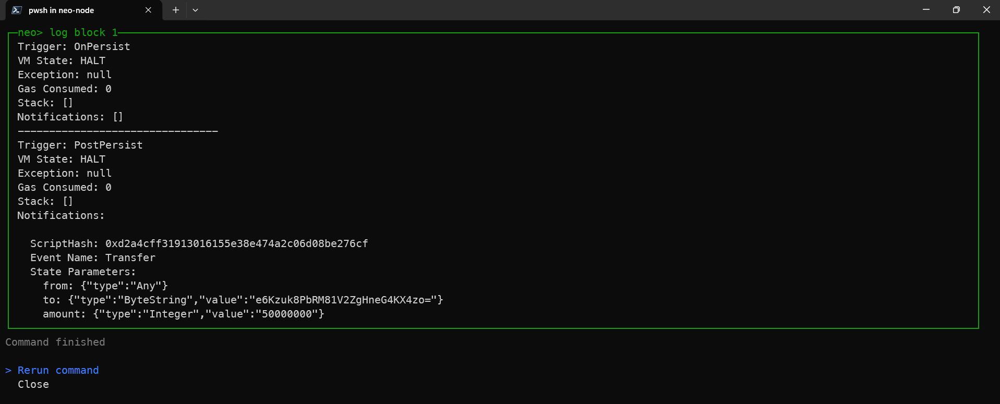
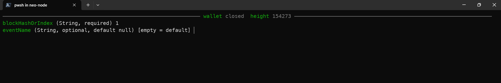
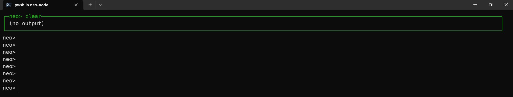

# neo-tui

Cross-platform console UI for **neo-cli** (Windows, Linux, macOS).

It starts the same `MainService` node as `neo-cli`, loads plugins from `Plugins/` the same way, then shows the live **show state** dashboard.

- Live **node status** (block height, mempool, peers, sync) — same data as `show state`
- **CONNECTED PEERS** from `LocalNode` (Up/Down to scroll when there are more than five)
- Command **output popup** on this console with **Please wait** until the command finishes, then **Rerun command** or **Close**
- Category **menus** (`M` / Enter from the status screen)
- **Command palette** of every `[ConsoleCommand]`, including plugin commands
- **Line editor** with history, Tab complete, Ctrl+A/E/U
- Direct `System.CommandLine` subcommands (`neo-tui help`, `neo-tui show block 1`, …)

## Run (from repo)

```bash
dotnet run --project src/Neo.ConsoleUI
```

Or after build:

```bash
dotnet build src/Neo.ConsoleUI/Neo.ConsoleUI.csproj
# output: src/Neo.ConsoleUI/bin/Debug/net10.0/neo-tui.dll
dotnet src/Neo.ConsoleUI/bin/Debug/net10.0/neo-tui.dll
```

Startup flags match neo-cli: `--config`/`-c`, `--wallet`/`-w`, `--password`/`-p`, `--db-engine`, `--db-path`, `--plugins`, `--noverify`.

The working directory is the exe folder so `Plugins/`, `config.json`, and auto-install zips resolve the same way as neo-cli. On build, each plugin is copied next to the binary: `bin/$(Configuration)/$(TargetFramework)/Plugins/<Name>/` (the folder is created if it is missing). Extra plugins can still be installed at runtime (`--plugins RpcServer` or the `install` command).

## Screenshots

Wide status dashboard — 2×2 metrics, sync bar, **CONNECTED PEERS** on the right (title on the time row, table aligned with BLOCKCHAIN STATUS):



Peer list scrolled (`6-10/10`):



Narrow window — peers drop below the 2×2:



Command menu (`M` / Enter):



Plugin commands:



Please wait while a command runs:



Command output popup — **Rerun command** / **Close**:





Menu command parameters:



Command line (`C`) — same `neo>` prompt as neo-cli:


