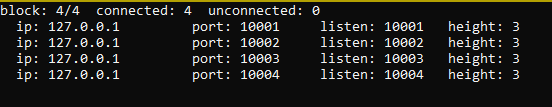
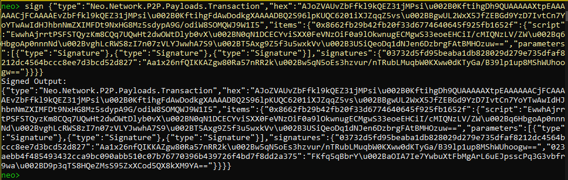

## Setting a private net with neo-cli

1. [Clone](https://docs.neo.org/docs/en-us/node/cli/setup.html#publishing-from-neo-cli-source-code) the newer version of [Neo-Node](https://github.com/neo-project/neo-node) for each consensus node you desire to set on your privatenet and another that will be used to access the Neo-Cli and to transfer GAS or NEO. It is necessary to have multiples copies of the Neo-Node project because each copy will receive a different configuration file.
2. For each copy of the project:
- Run the neo-cli.exe inside the path "neo-cli\bin\Debug\netcoreapp3.0"
- Enter the command `create wallet <path>` with a name for the wallet
- Follow the instructions and don't forget to write down every public key, name of the wallet and password for the next step
3. Set the `config.json` that are located inside the folder neo-cli as the example below:

`config.json` (consensus node):
```json
{
       "ApplicationConfiguration": {
           "P2P": {
               "Port": 10001, 
               "WsPort": 20001,
               "MaxConnectionsPerAddress": 5 
           },
           "RPC": {
               "BindAdress": "127.0.0.1",
               "Port": 30001,
               "SslCert": "",
               "SslCertPassword": ""
           },
           "UnlockWallet": {
               "Path": "my\\path\\node1.json",
               "Password": "1", 
               "StartConsensus": true,
               "IsActive": true
           },
           "PluginURL": "https://github.com/neo-project/neo-modules/releases/download/v{1}/{0}.zip"
       }
   }
```
- Remember to set different port numbers for each node for "P2P" and "RPC".
- Max connections default is 3, if you're using 4 consensus nodes or more, change this number to at least the number of consensus node plus one. This tutorial set 4 consensus nodes, so it must be at least `"MaxConnectionsPerAddress": 5`.
- In "UnlockWallet" it must have the path and the password of the wallet created in that node. Different nodes must have different wallets.
- Remember to escape the `\` character, so the paths must have `\\` between each folder.

4. Set the `protocol.json` that are located inside the folder neo-cli as the example below:
`protocol.json:`
```json
{
       "ProtocolConfiguration": {
           "Magic": 46712467,
           "MillisecondsPerBlock": 15000,
           "StandbyValidators": [
               "03b4bdf93e40c60f59e5fdeee70c6456ffb75128907a80ead5d3497a7e83cdbae0",
               "0262f8925d7d057953733a21746bd94e9309ee80408c8304b7ddea1e1070a223f7",
               "023aebb4f485493432cca9bc090abb510c07b76770396b439726f4bd7f8dd2a375",
               "03732d5fd95beaba1db828029d279e735dfaf8212dc4564bccc8ee7d3bcd52d827"
           ],
           "SeedList": [
               "localhost:10001",
               "localhost:10002",
               "localhost:10003",
               "localhost:10004"
           ]
       }
   }
```
- The "Magic" is the ID of the chain, it can be any integer in the range of [0 - 4294967295]. It must be the same number in all nodes.
- Standby Validators are the public keys of each wallet set in the "UnlockWallet" on "config.json".
- The number of the port set in P2P in each node must be in "SeedList".

5. To access GAS and NEO, you can set a non-consensus node. The protocol is the same as the consensus nodes, you also need to create a wallet, write the path and the password in the field "Unlockwallet" but you must set the "StartConsensus" to false. The ports in "P2P" and "RPC" also must be different from the other config files.

config.json (non-consensus node):
```json
{
  "ApplicationConfiguration": {
    "P2P": {
      "Port": 10003,
      "WsPort": 10004
    },
    "RPC": {
      "BindAddress": "127.0.0.1",
      "Port": 10002,
      "SslCert": "",
      "SslCertPassword": "",
      "MaxGasInvoke": 10
    },
    "UnlockWallet": {
      "Path": "node.json",
      "Password": "one", 
      "StartConsensus": false,
      "IsActive": true
     },
    "PluginURL": "https://github.com/neo-project/neo-plugins/releases/download/v{1}/{0}.zip"
  }
}

```
6. Run each consensus node first and then the non-consensus. 

7. Enter the command `show stats` in the non-consensus node terminal and wait. All the nodes started before should connect like the image below:
 


## Retrieving NEO and GAS in the privatenet using Neo-Cli

The following steps are to transfer some GAS or NEO in a wallet. If you won't make any transaction that uses GAS or NEO, you don't need to continue this tutorial, your privatenet is already running.
 
1. On the same terminal, create a wallet to receive the GAS or NEO and save its address.
  
2. Open a wallet from a consensus node and create a multi-signature address using the command `import multisigaddress m pubkeys` with the minimal number of signatures needed to complete the transaction and the public keys in Standby Validators in all consensus node wallets.
 
 

3. Use the command `send <id|alias> <address> <value>` with the address of the wallet created on step 1, copy the SignatureContext and close the wallet.


4. Open another wallet listed on the multi-signature, use the command `sign <jsonObjectToSign>` with the object copied in step 3, copy the object in Signed Output and close the wallet.


 
 5. Repeat the previous step the number of times put as minimal in step 2. Then you can use `relay <jsonObjectToSign>` and your wallet is ready.
 


